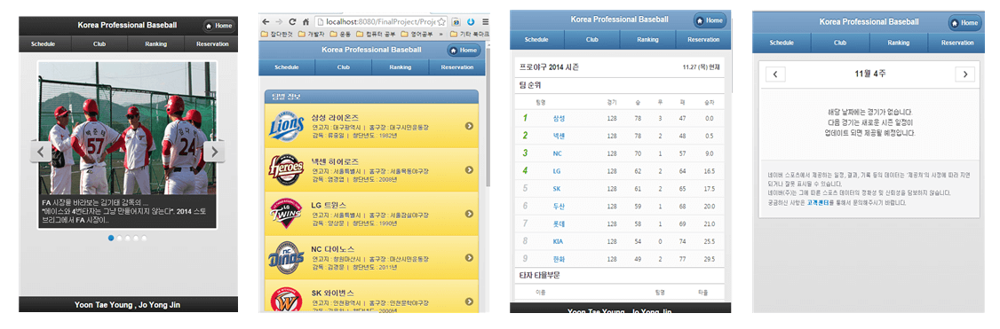

# 프로야구 정보 모바일 웹 사이트
* 기간 : 2014.11.8. ~ 12.15
* 주최 : 3학년 2학기 모바일 웹 프로그래밍 수업 기말 프로젝트
* 참여자 : 윤태영, 조용진

----
##사진

----
## 개발 내역

1. 주제 : 프로야구 모바일 웹앱
2. 특징 : 프로야구 각종 정보 및 구단 별 정보 제공(순위, 구단 홍보영상, 스케줄 등)
3. 개발 툴 : Eclipse, Ms-sql, Tomcat 8.0
4. 개발 기술 : JSP, JavaScript, HTML5, CSS3, Jquery

----
## 진행 및 소득
* 모바일 웹 프로그래밍 수업 프로젝트로 2인 1조 프로젝트
* 모바일 웹앱 서비스의 구조의 이해 그리고 JSP를 활용한 서버 구축, 프론트엔드 기술 적용 방법을 습득 

----
## 소스코드
* [개발 코드](https://github.com/yung6699/BaseballMobileWebPage)
